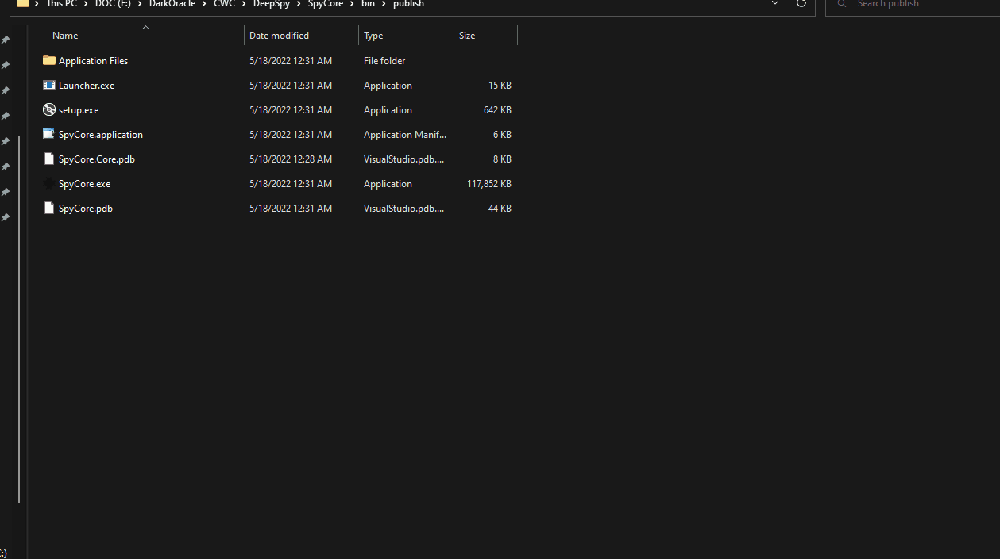

# SpyCore

SpyCore - Windows Malicious FIle Scanner (Distributes)

SpyCore is a malicious file scanner, using various public APIs to scan a file and retrieve and display the results of that file.
With a multiAV scanner and a community result viewer to give you the best and most accurate read of a file.

